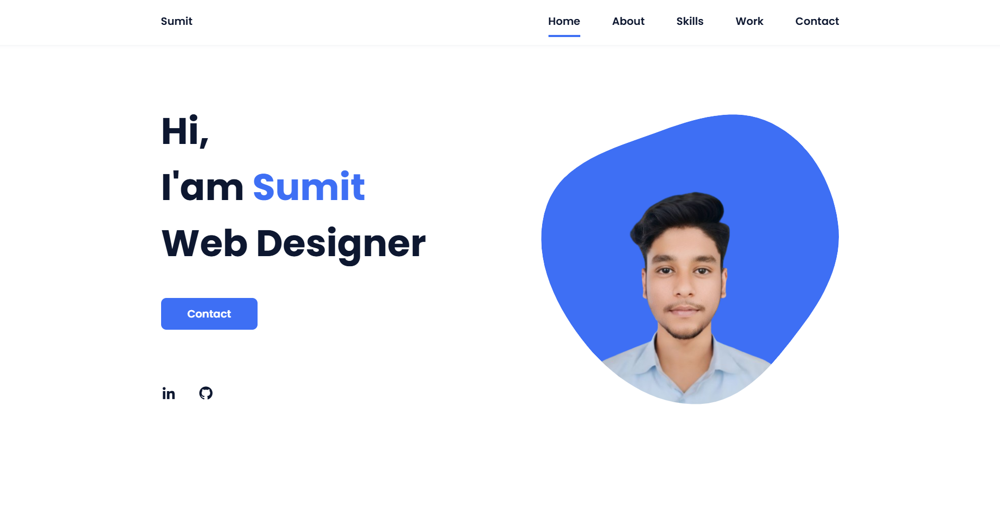
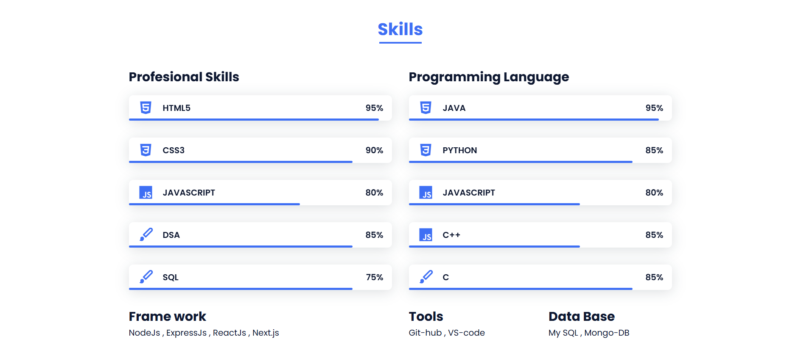
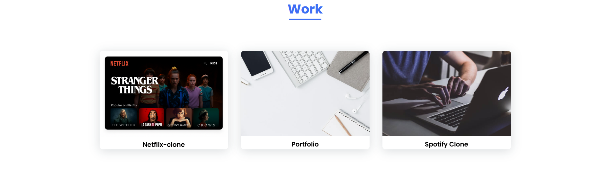
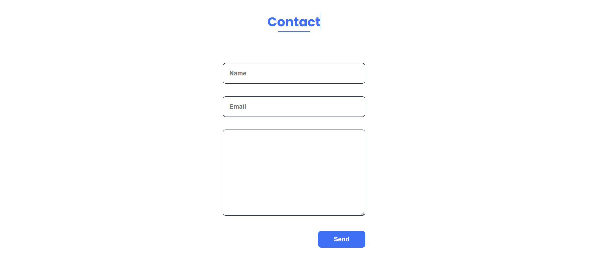

# 🌐 My Portfolio

This is my personal **portfolio website**, built to showcase my projects, skills, and experience.  
It is fully responsive and designed with modern web technologies.

---

## 🚀 Features
- Responsive design (mobile + desktop friendly)
- Project showcase with live demo & source code links
- About Me section
- Contact form / social media links
- Clean and minimal UI

---

## 🛠️ Tech Stack
- **HTML5**
- **CSS3 / TailwindCSS / Bootstrap** (choose your framework)
- **JavaScript (ES6+)**
- (Optional) **React.js / Next.js** if you used

---

## 📂 Project Structure
portfolio/
├── index.html
├── css/
│ └── style.css
├── js/
│ └── script.js
├── assets/
│ ├── images/
│ └── icons/
└── README.md

---

## 📸 Screenshots

Here are some previews of my portfolio:

### 🖼️ Home Page  

### 🖼️ Projects Section  

### 🖼️ About Me  

### 🖼️ Contact Page  

---

## 🔗 Live Demo
👉 [Click here to view my Portfolio](https://isuumitt.github.io/Sumit-portfolio/)

(if show any type or error then reopen in incognito tab )

 

## 🔗 Or
👉 [Try this ](https://heartfelt-valkyrie-95557d.netlify.app)

---

## 📬 Contact
- **LinkedIn:** [Your LinkedIn](https://www.instagram.com/isuumitt/)
- **GitHub:** [Your GitHub](https://github.com/isuumitt)  
- **Email:** kumarsumit48338@gmail.com

---

⭐ If you like this project, don't forget to **star the repo**!
